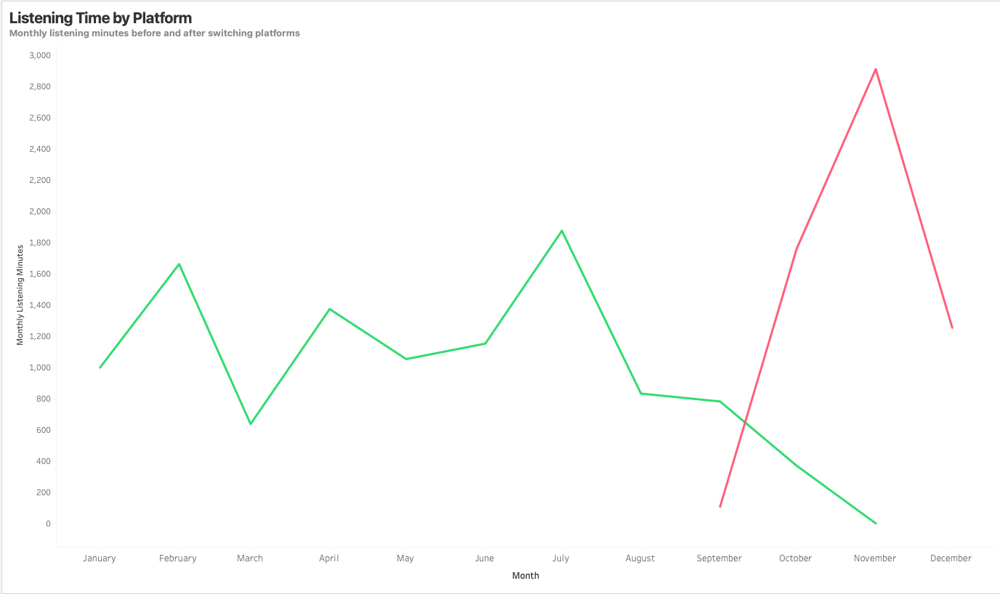
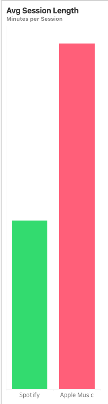
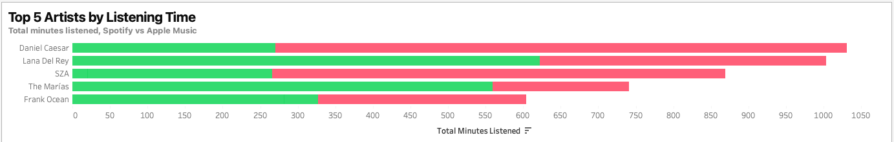
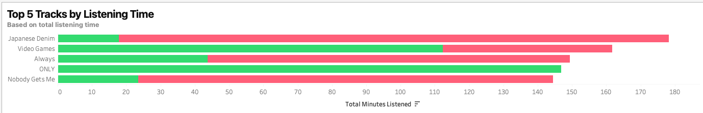

# MusicPlatformInsights

## Cross-Platform Music Listening Behavior Analysis

## Introduction

In this project, I used Python, SQLite, and Tableau to analyze my personal music listening behavior across Spotify and Apple Music. The goal was to move beyond basic “top artists” summaries and instead understand how my listening habits changed over time, especially before and after switching platforms.

By modeling listening activity at the event and session level, this project focuses on engagement patterns such as listening volume, session behavior, repeat listening, and preference concentration. The dashboard is designed to feel more like a year-in-review experience than a traditional BI report, emphasizing clarity, storytelling, and interpretability.

This project mirrors real-world analytics problems like multi-source data integration, KPI design, and translating raw behavioral data into insights that are easy to understand and communicate.
	•	The published Tableau dashboard can be found [here](https://public.tableau.com/app/profile/nathan.ho2158/viz/MusicWrapped/MusicWrapped)

Preview of Dashboard here:
[](https://public.tableau.com/app/profile/nathan.ho2158/viz/MusicWrapped/MusicWrapped)

---

## Table of Contents
- [Overview](#overview)
- [Analytical Objectives](#analytical-objectives)
- [Canonical Listening Event Model](#canonical-listening-event-model)
- [Data Ingestion & Normalization](#data-ingestion--normalization)
- [Key Insights & Analysis](#key-insights--analysis)
- [Engagement KPIs](#engagement-kpis)
- [Data Storage](#data-storage)
- [Visualization](#visualization)
- [Project Structure](#project-structure)
- [Why This Project](#why-this-project)

---

## Overview

MusicPlatformInsights is a user behavior analytics project that explores how listening habits change over time across streaming platforms. Instead of treating music activity as a series of isolated plays, the project frames listening as a behavioral pattern problem, focusing on session behavior, habit formation, and preference concentration.

Listening history from Spotify and Apple Music is ingested from raw user exports, normalized into a shared event-level schema, and stored in a unified SQLite database. From this foundation, a set of interpretable, behavior-focused KPIs is derived to capture engagement intensity, session dynamics, preference diversity, and discovery behavior.

Insights are presented through a narrative-style Tableau dashboard inspired by consumer product analytics, emphasizing clarity, storytelling, and how users actually experience music over time.

---

## Analytical Objectives

The primary objectives of the project are to:

- Normalize heterogeneous streaming data into a single, platform-agnostic event model  
- Summarize individual-level listening behavior over time  
- Model engagement patterns beyond simple top-N summaries  
- Compare listening habits across platforms within a unified analytical framework  
- Translate raw event data into intuitive, user-facing insights  

The emphasis is on **clarity, interpretability, and storytelling**, not algorithmic complexity.

---

## Canonical Listening Event Model

All listening data is mapped into a standardized event-level schema shared across platforms.

Each row represents a single listening event and includes:

- `event_time` — Timestamp of the listening event (UTC)  
- `platform` — Source platform (`spotify`, `apple_music`)  
- `artist` — Artist name (best-effort for Apple Music)  
- `track` — Track name  
- `duration_minutes` — Minutes listened during the event  
- `session_id` — Derived identifier grouping events into listening sessions  

This schema is intentionally minimal and designed to support behavioral analysis rather than perfect metadata reconciliation.

---

## Data Ingestion & Normalization

### Spotify

- Listening history ingested from exported Spotify Streaming History JSON files  
- Timestamps localized and converted to UTC  
- Play durations converted from milliseconds to minutes  
- Very short plays filtered using a minimum duration threshold  
- Session IDs generated based on inactivity gaps  

### Apple Music

- Listening history ingested from Apple Music Play Activity CSV exports  
- Timestamps parsed and normalized to UTC  
- Play durations converted from milliseconds to minutes  
- Session IDs generated using the same logic as Spotify  
- Artist metadata partially enriched via a left join with the Apple Music Library Tracks export  

Due to Apple Music data limitations, some events (e.g. radio, autoplay, editorial content) do not resolve cleanly to library tracks and remain unmatched. This behavior is expected and documented.

---

## Key Insights & Analysis

### 1. Cross-Platform Listening Overview


This dashboard provides a consolidated view of my listening behavior across Spotify and Apple Music after normalizing both platforms into a shared event-level schema. Rather than focusing on individual songs or artists in isolation, the dashboard highlights how overall engagement, session behavior, and listening structure change across platforms.

The goal is to understand *how* I listen, not just *what* I listen to.

---

### 2. Listening Time Shift by Platform



After switching from Spotify to Apple Music, total listening time increased noticeably, particularly in the months following the platform switch. Listening volume became less evenly distributed, with clearer peaks rather than steady background usage.

This pattern suggests a shift away from passive listening toward more intentional, high-engagement listening periods.

---

### 3. Session Behavior and Engagement



Session-level metrics indicate that listening sessions on Apple Music tend to be longer on average than those on Spotify. While overall session frequency declined, individual sessions lasted longer, pointing to fewer but more sustained listening periods.

This behavior aligns with more deliberate engagement rather than frequent, short interactions.

---

### 4. Artist Concentration



Listening time became more concentrated among a smaller set of artists after the platform switch. A handful of artists account for a larger share of total listening minutes, indicating increased replay behavior rather than broad exploration.

This reflects deeper engagement with familiar artists rather than continuous discovery.

---

### 5. Track-Level Replay Behavior



A similar concentration pattern appears at the track level. Post-switch listening shows heavier replay of specific songs, with fewer tracks accounting for a disproportionate share of total listening time.

Together with artist concentration, this suggests a shift toward focused listening habits built around favorites.

---

## Engagement KPIs

The dashboard insights are supported by a set of interpretable, behavior-focused KPIs derived from the normalized listening event table. These metrics are designed to capture *how listening happens*, not just *what is listened to*.

### Total Listening Minutes
Measures overall engagement volume across platforms and provides baseline context for changes in listening behavior over time.

### Session Depth
Represents the average number of listening events per session. Higher values indicate longer, more continuous listening periods, while lower values suggest fragmented or background listening behavior.

### Average Listen Duration
Captures the average time spent per listening event, helping distinguish between brief skips and sustained engagement.

Together, these KPIs reinforce the core finding of the project: after switching platforms, listening behavior shifted toward fewer sessions, longer engagement periods, and more focused replay patterns.

---

## Data Storage

All normalized listening events are stored in a single SQLite database:

- **Database:** `MusicPlatformInsights.db`  
- **Table:** `listening_events`  

Spotify events initialize the table. Apple Music events are appended after enrichment, replacing prior Apple rows to avoid duplication.

Derived KPI tables are exported as CSVs for use in Tableau.

---

## Visualization

Insights are delivered through a **Tableau dashboard** designed as a year-in-review style experience rather than an operational BI report.

The dashboard emphasizes narrative flow, visual hierarchy, and interpretability, allowing users to explore how listening behavior evolved over time and differed across platforms.

---

## Project Structure

```
MusicPlatformInsights/
├── notebooks/
│ ├── LoadSpotifyData.ipynb
│ ├── LoadAppleData.ipynb
│ ├── AddAppleArtists.ipynb
│ ├── EngagementKPIs.ipynb
│ ├── ExportToTableau.ipynb
├── data/
│ ├── raw/
│ ├── processed/
│ └── kpis/
├── images/
│ ├── MusicWrapped.png
│ ├── ListeningTime.png
│ ├── SessionLength.png
│ ├── TopArtists.png
│ ├── TopTracks.png
├── dashboards/
├── docs/
│ ├── canonical_schema.md
│ ├── kpi_definitions.md
├── README.md
```

---

## Why This Project

While centered on personal music data, this project mirrors real-world analytics problems such as multi-source data integration, behavioral modeling, KPI design, and insight communication.

The focus is on transforming raw event data into meaningful, user-facing insights, reflecting how modern consumer products use analytics to understand and communicate user behavior.